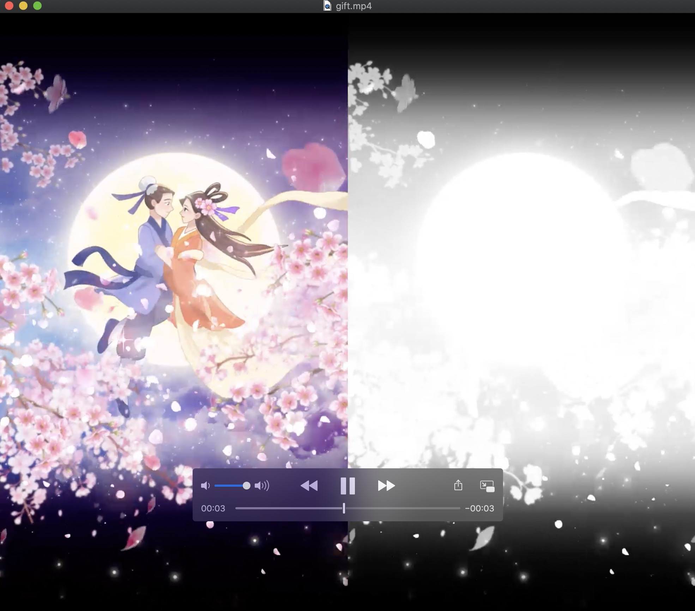
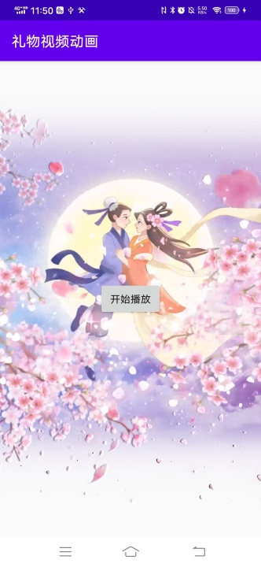

用于 播放 带有透明度信息的 礼物动画视频

### 支持上面彩色，下面透明

app:alphaModel="top_to_alpha_bottom"

<com.meikai.giftplayer.GiftVideoView

    android:id="@+id/gift_video_view"
    
    android:layout_width="match_parent"
    
    android:layout_height="match_parent"
    
    app:alphaModel="top_to_alpha_bottom"
    
    app:scaleType="fitXY"/>

### 支持左边彩色，右边透明

alphaModel改为    app:alphaModel="left_to_alpha_right"

源视频文件，如下图所示:

合成后的效果图如下：

